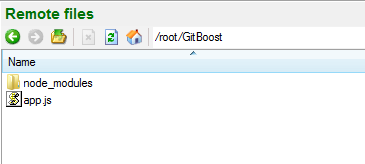

# GitBoost
an elegant and modern git Server coded in javascript for nodeJS

## Install From Git / Zip or Tar

download a release and extract it.

in terminal, just write
```
   npm install
```

## Install From npm

create a directory and in terminal, write
```
   npm install gitboost
```

then don't forget to create a app.js file in the directory with
```
   var gitboost = require("gitboost");
```


## Configure the App

Modify the 'config.js' file with your configuration !
the file it's in "node_modules/gitboost" if you have a npm installation

```
   client : '/usr/bin/git' ,       //-- Your git executable path
   default_branch : 'master' ,     //-- Default branch when HEAD is detached
       repositories : [  
        "F:/_data_/"                //-- example for windows but work with unix to !
    ],                              //-- Path to your repositories
```
```
    tempDir : "F:/tmp/",      //-- temp directory for download archive
    theme : "bootstrap3",           //-- set your theme ( only bootstrap3 for the moment)
    defaultLogin : "admin",         //-- default login for push/pull
    defaultPassword : "admin"       //-- default password for push/pull
```

it's all , the installation is complete !

## Start the App

in terminal, just write
```
   node app.js
```

this start the application and type http://localhost:1337 in your favorite navigator !

for change this port, just set env PORT to your port number and restart the application or configure it in config.js

## Screenshot

if you want to see an example :

Repo list


File List with ReadMe.md


Commits list with gravatar support


Repo Stats


Repo Graph ( Work in progress / Proof of concept )


# FAQ

it's a Beta, all features are not implemented !!!!!!!
